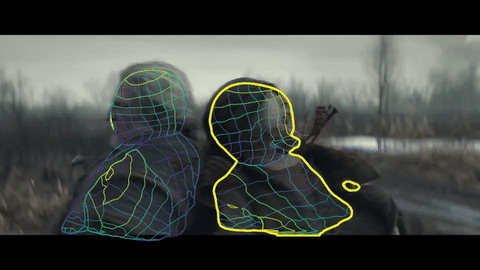

# Densepose with video

Step-by-step guide on how to install densepose with script for test on video file.

[](https://youtu.be/0w-fCotB2z8)

Tested on `AWS-EC2 p2.xlarge` intance.

The modified scripts here are based on the work of [trrahul](https://github.com/trrahul/densepose-video) thanks!!.

# Installation

The DensePose-RCNN system is implemented within the [`detectron`](https://github.com/facebookresearch/Detectron) framework.


**Requirements:**

- NVIDIA GPU, Linux, Python2
- Caffe2
- Various standard Python packages, and the COCO API; Instructions for installing these dependencies are found below


**Installing Caffe2**

Caffe2 is now merged into pytorch-nightly.

To install Caffe2 with CUDA support, follow the [installation instructions](https://caffe2.ai/docs/getting-started.html) from the [Caffe2 website](https://caffe2.ai/). **If you already have Caffe2 installed, make sure to update your Caffe2 to a version that includes the [Detectron module](https://github.com/pytorch/pytorch/tree/master/modules/detectron).**

**If not installed Caffe2**

With Ananaconda, create an virtual enviroment for install pytorch-nightly with python2.7, for example:

```
ubuntu@ip-172-31-93-5:~$ conda create -n pytorch_p27 python=2.7 anaconda
```

Then, activate this virtual enviroment with:
```
ubuntu@ip-172-31-93-5:~$ conda activate pytorch_p27

(pytorch_p27) ubuntu@ip-172-31-93-5:~$ 

```
Into the enviroment just install pytorch-nightly as described in the [caffe2 page](https://caffe2.ai/docs/getting-started.html?platform=ubuntu&configuration=prebuilt)

For Caffe2 with CUDA 9 and CuDNN 7 support:

```
conda install pytorch-nightly -c pytorch

```
Please ensure that your Caffe2 installation was successful before proceeding by running the following commands and checking their output as directed in the comments.

```
# To check if Caffe2 build was successful
python -c 'from caffe2.python import core' 2>/dev/null && echo "Success" || echo "Failure"
....
....
must log ... "Success"

# To check if Caffe2 GPU build was successful
# This must print a number > 0 in order to use Detectron
python -c 'from caffe2.python import workspace; print(workspace.NumCudaDevices())'
....
....
must log ... "1" 
if you have 1 GPU.
```

## Other Dependencies

Install the [COCO API](https://github.com/cocodataset/cocoapi):

```
# COCOAPI=/path/to/clone/cocoapi, for example

mkdir ~/cocoapi
COCOAPI=~/cocoapi
git clone https://github.com/cocodataset/cocoapi.git $COCOAPI
cd $COCOAPI/PythonAPI

# Install into global site-packages
make install

# Alternatively, if you do not have permissions or prefer
# not to install the COCO API into global site-packages
python setup.py install --user
```
Note that instructions like `# COCOAPI=/path/to/install/cocoapi` indicate that you should pick a path where you'd like to have the software cloned and then set an environment variable (`COCOAPI` in this case) accordingly.


## Installing Detectron

This document is based on the Detectron installation instructions, for troubleshooting please refer to the [`detectron installation document`](https://github.com/facebookresearch/Detectron/blob/master/INSTALL.md).

Clone the Detectron repository, for example:


```
# DETECTRON=/path/to/clone/detectron

mkdir ~/detectron
DETECTRON=~/detectron
git clone https://github.com/facebookresearch/detectron $DETECTRON
```

Install Python dependencies:

```
pip install -r $DETECTRON/requirements.txt
```

Set up Python modules:

```
cd $DETECTRON && make
```

Check that Detectron tests pass (e.g. for [`SpatialNarrowAsOp test`](detectron/tests/test_spatial_narrow_as_op.py)):

```
python $DETECTRON/detectron/tests/test_spatial_narrow_as_op.py
```

## Installing DensePose


## Densepose

Clone the Densepose repository:

```
# DENSEPOSE=/path/to/clone/densepose, for example:

mkdir ~/densepose
DENSEPOSE=~/densepose
git clone https://github.com/facebookresearch/densepose $DENSEPOSE

```


Install Python dependencies:


```
pip install -r $DENSEPOSE/requirements.txt
```

**FIX DETECTRON PATHS**

I resolved it by copying `Detectron/detectron/utils/*.so` to `DensePose/detectron/utils/ `.
Copy the utils *.so from detectron/utils repo to densepose/detectron/utils folder


```
cp $DETECTRON/detectron/utils/*.so  $DENSEPOSE/detectron/utils/
```

Also fix the paths in the *`densepose`* cloned repo with the *`detectron`* library replacing the native densepose `env.py` withthe `env.py` from *`detectron`*:

```
cp $DETECTRON/detectron/utils/env.py  $DENSEPOSE/detectron/utils/

```

Set up Python modules:

```
cd $DENSEPOSE && make
```

Check that Detectron tests pass (e.g. for [`SpatialNarrowAsOp test`](tests/test_spatial_narrow_as_op.py)):

```
python2 $DENSEPOSE/detectron/tests/test_spatial_narrow_as_op.py
```


## That's All You Need for Inference
At this point, you can run inference using pretrained Detectron models. Take a look at our [inference tutorial](GETTING_STARTED.md) for an example. If you want to train models on the COCO dataset, then please continue with the [original repo](https://github.com/facebookresearch/DensePose/blob/master/INSTALL.md#fetch-densepose-data)


## TEST with video

Put the `.py ` files with your $DENSEPOSE/tools/ dir.

**Download pretrained weights**

You can donwload pre-trained weights from the official densepose [MODEL ZOO](https://github.com/facebookresearch/DensePose/blob/master/MODEL_ZOO.md)

We choose the following pre-trained weights.

```
cd $DENSEPOSE
wget https://dl.fbaipublicfiles.com/densepose/DensePose_ResNet101_FPN_s1x-e2e.pkl
```

**Choose the Config yaml file**

You can choose different configs [here](https://github.com/facebookresearch/DensePose/blob/master/configs/)

For the pre-trained weight above, we download the next config file.

```
cd $DENSEPOSE/configs

wget https://raw.githubusercontent.com/facebookresearch/DensePose/master/configs/DensePose_ResNet101_FPN_s1x-e2e.yaml
```
## Download the UV_data

For start the testings, you must to download the UV_DATA, go to:
```
cd $DENSEPOSE/DensePoseData

bash get_densepose_uv.sh
```
**For test with video**

```
python tools/infer_vid.py \
    --cfg configs/DensePose_ResNet101_FPN_s1x-e2e.yaml  \
    --output-dir DensePoseData/infer_vid/  \
    --wts DensePose_ResNet101_FPN_s1x-e2e.pkl  \
    --input-file justice.mp4
```

Note: Requires about 4GB VRAM.

If you use ResNet101_FPN_s1x model, you need more than 4GB of memory.
If you have only 4GB use ResNet50_FPN_s1x.


Here is also you can get configs and models from here.

* https://github.com/facebookresearch/DensePose/tree/master/configs
* https://github.com/facebookresearch/DensePose/blob/master/MODEL_ZOO.md
    


Additional requirement for build the video - ffmpeg

##### Tested with 
* AWS EC2 p2.xlarge intance (Ubuntu deep learning machine AMI)
* Anaconda
* Ubuntu 18.04
* Cuda 9.0
* CUDNN 6
* opencv 3.4
* NVIDIA Tesla K80  (12GB VRAM)

## Example, ran on Geralt doing some witcherin'



## And a bit of Night city.

